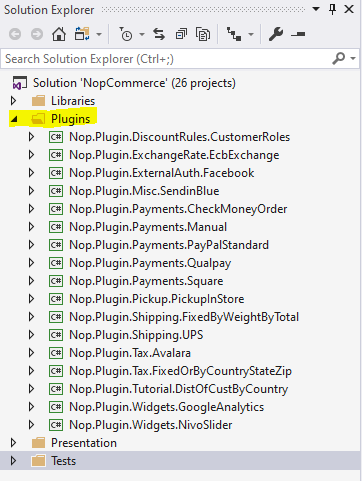
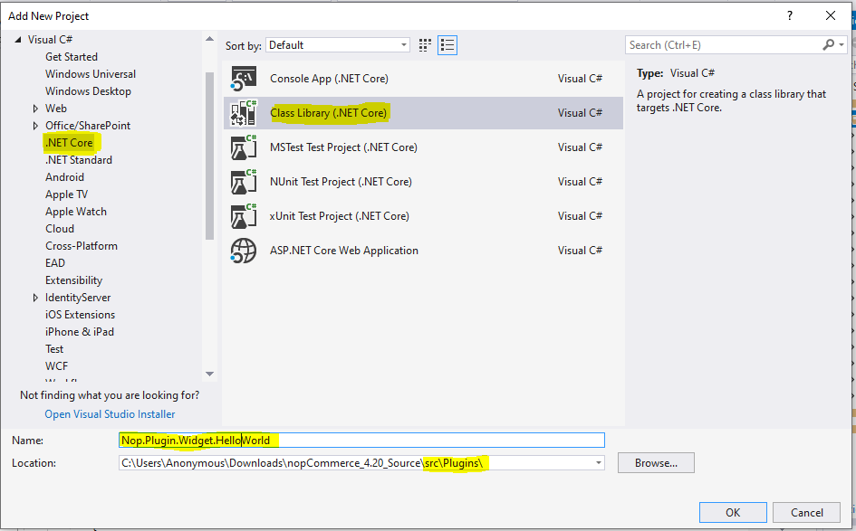
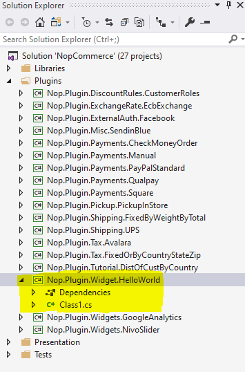
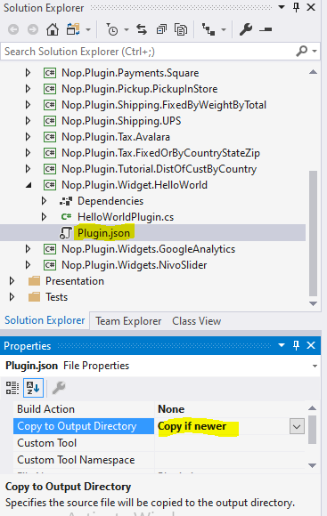
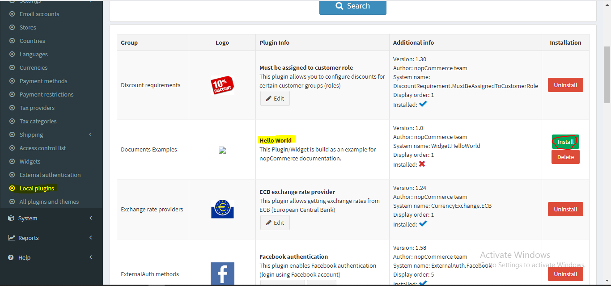
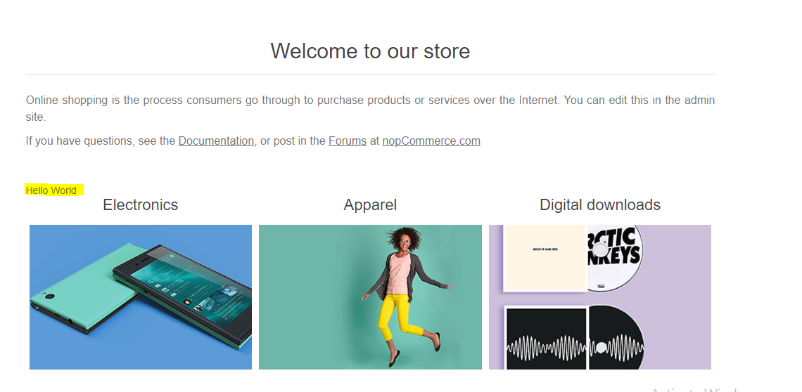

---
title: A guide to expanding the functionality of the basic functions of nopCommerce through a plugin
uid: en/developer/tutorials/guide-to-expanding-the-functionality-of-the-basic-functions-of-nop-commerce-through-a-plugin
author: nop.sea
contributors: git.RomanovM, git.DmitriyKulagin
---

# A guide to expanding the functionality of the basic functions of nopCommerce through a plugin

## Overview

nopCommerce uses the plugins system to extend the functionality of nopCommerce admin panel and uses widget system to extend the functionality of the website. Plugins and Widgets are a set of independent programs or components which can be added to an existing system to extend some specific functionality and also can be removed from system without effecting the main system during the process. So by using the concept of Plugin and widgets we can add more functionality to our system and we can build them without altering or editing the core source code of nopCommerce solution. Which enables us to upgrade or downgrade our nopCommerce solution to the latest version or older version as we desire without having to rewrite plugin and widgets we already created.

## Difference between Plugin and Widget

As we know both Plugin and widget are for extending the functionality of nopCommerce solution. Well then you may ask "what is the difference between them". Ultimately in nopCommerce you can think widget as a plugin but with extra feature. In order to create widget the process is mostly the same as creating a plugin, but by using widget we can show some UI (User Interface) to nopCommerce public website in some specific areas predefined by nopCommerce which is known as widget-zones. Which we cannot achieve only via plugin. You may think Widget as a Superset of Plugin.

I think you are bit more clear about what widgets and plugins are, when they can be used and what is the benefits of using them. So, now lets go and create a simple widget that shows "Hello World" message to the public site, to understand about how to create a widget in nopCommerce.

## Initialize Plugin Project

### Step 1: Create a new project

Go to the nopCommerce official website and download latest nopCommerce source code. Since right now the latest version is 4.2, this documentation is written according to v4.2. Open your nopCommerce solution in your favorite IDE (Visual Studio is recommended). There you will see a bunch of folders, If you want to know all about the folder structure then you may want to visit nopCommerce documentation. In the roof of the solution you will see a "Plugins" folder, expand that folder and you will see a list of plugin projects shipped with nopCommerce by default.



In order to create new Widget project, Right click on "Plugins" folder: Add=>New Project. After that add new project window will appear.



From left list of project type select ".NetCore" from that choose "Class Library" project Template. nopCommerce follows some standard naming conversion, which you can get more information from nopCommerce documentation. I have choose "Nop.Plugin.Widget.HelloWorld" as my project name by following the naming conversion of nopCommerce. And the location should be inside "/source/Plugins" directory. Now click "OK". This should create a new project inside Plugin directory. And you may see in your solution like this:



### Step 2: Configure your new project to be used as Widget

We need to configure a couple of things in our project for it to be used as a Plugin or Widget.

After you create your project successfully open its .csproj file, for that right click on your project and click {Your_Project_Name.csproj} menu from context menu and replace its content with the following code.

```xml
<Project Sdk="Microsoft.NET.Sdk">
    <PropertyGroup>
        <TargetFramework>netcoreapp2.2</TargetFramework>
        <Copyright>SOME_COPYRIGHT</Copyright>
        <Company>YOUR_COMPANY</Company>
        <Authors>SOME_AUTHORS</Authors>
        <PackageLicenseUrl>PACKAGE_LICENSE_URL</PackageLicenseUrl>
        <PackageProjectUrl>PACKAGE_PROJECT_URL</PackageProjectUrl>
        <RepositoryUrl>REPOSITORY_URL</RepositoryUrl>
        <RepositoryType>Git</RepositoryType>
        <OutputPath>..\..\Presentation\Nop.Web\Plugins\{PLUGIN_OUTPUT_DIRECTORY}</OutputPath>
        <OutDir>$(OutputPath)</OutDir>
        <!--Set this parameter to true to get the dlls copied from the NuGet cache to the output of your    project. You need to set this parameter to true if your plugin has a nuget package to ensure that   the dlls copied from the NuGet cache to the output of your project-->
        <CopyLocalLockFileAssemblies>false</CopyLocalLockFileAssemblies>
    </PropertyGroup>
    <ItemGroup>
        <ProjectReference Include="..\..\Presentation\Nop.Web.Framework\Nop.Web.Framework.csproj" />
    </ItemGroup>
    <!-- This target execute after "Build" target -->
    <Target Name="NopTarget" AfterTargets="Build">
        <!-- Delete unnecessary libraries from plugins path -->
        <MSBuild Projects="@(ClearPluginAssemblies)" Properties="PluginPath=$(MSBuildProjectDirectory)\ $(OutDir)" Targets="NopClear" />
    </Target>
</Project>
```

Here replace {Plugin_Output_Directory} by your project name, in my case "Widget.HelloWorld".

What this will do is it copies all dll files related to this project into the `Nop.Web/Plugin/{Plugin_Output_Directory}`, because Plugin directory inside `Nop.Web` is the location where nopCommerce search from plugins and widgets to display in Plugin or widget list in admin panel.

### Step 3: Create a Plugin.json file

This file is required for every Plugin or Widget we create in nopCommerce. This file contains meta information about our plugin that describes our plugin. It contains information like, Name of our plugin, which version of nopCommerce it is target/built for, some description about our plugin, version of our plugin and so on. After you create "Plugin.json" file, copy this content inside your file and modify according to your requirement.

```json
{
    "Group": "Documents Examples", //Group of Project, this may be your company name
    "FriendlyName": "Hello World", //Friendly Name for your plugin/widget
    "SystemName": "Widget.HelloWorld", //This is unique among all plugins/widgets
    "Version": "1.0", //Version of your Plugin/Widget
    "SupportedVersions": [ "4.20" ], //Version of nopCommerce this Plugin/Widget is supported for. We can add multiple versions, since it is an array.
    "Author": "nopCommerce team", //This can be your name or your Team Name
    "DisplayOrder": 1,
    "FileName": "Nop.Plugin.Widget.HelloWorld.dll", //Output dll file name
    "Description": "This Plugin/Widget is build as an example for nopCommerce documentation." //Short description about your plugin/widget.
}
```

This file is used by nopCommerce while listing our Plugin/Widget in the plugin list in admin panel and to identify our plugin uniquely among all installed and uninstalled plugins in the entire application. So in order for nopCommerce to be able to read this file we need to copy this file to its output directory while building the project. To do that right click on Plugin.json file and click property. In Property set value for "Copy to output directory" to "copy if newer"



### Step 4: Create a class that extends from BasePlugin Class

Actually we need to have a class that inherent from IPlugin interface so that nopCommerce treats our project as plugin. But nopCommerce already has a class "BasePlugin" that inherits  from IPlugin interface and implements all methods form that interface. So, instead of inheriting from IPlugin interface we can extend from BasePlugin class. If we have some logic that needs to be executed during our plugin/widget installation and uninstallation process then we can override "Install" and "Uninstall" method from BasePlugin class to our class. Finally the class should look like this

```cs
public class HelloWorldPlugin: BasePlugin
{
    public override void Install()
    {
        //Logic during installation goes here...

        base.Install();
    }

    public override void Uninstall()
    {
        //Logic during uninstallation goes here...

        base.Uninstall();
    }
}
```

Now build your Project and run. Navigate to admin panel and under "Configuration" there is a "Local plugins" menu click that menu. Here you will see all plugins listed that are present in out `Nop.Web/Plugins` directory. In there you will see your newly created plugin. If you do not see then click on "Reload list of plugins" button, after that it will restart your application and lists all plugins available. Now you should see your plugin listed in that list. Click the green install button present in your plugins row.



Now after you click the install button, click "Restart your application to apply changes" button. It will restart your application and installs your plugin. After installation completes you will see a "Configure" and "Edit" button and a "Uninstall button" like this.

 Now your plugin is installed. But the "Configure" button will not work, since we don't have any configure page in our plugin.

## Create a widget to show some UI in our public Site

As previously mentioned, Widget is same as plugin but with extra features. So we can use this same plugin project to convert it to widget and render some UI to our public site. So lets see how we can extend this plugin to create a widget.

First we need to create a ViewComponent. Create a directory "Components" in the root of the project and create a ViewComponent class. We need to extend from this class from `NopViewComponent` base class.

```cs
[ViewComponent(Name = "HelloWorldWidget")]
public class ExampleWidgetViewComponent: NopViewComponent
{
    public IViewComponentResult Invoke(string widgetZone)
    {
        return Content("Hello World");
    }
}
```

Now go to the class one that extends from "BasePlugin" we have previously created, and inherent from IWidgetPlugin interface. This interface has two function declaration "GetWidgetZones" and "GetWidgetViewComponentName" which we need to implement in our class.

```cs
public class HelloWorldPlugin: BasePlugin, IWidgetPlugin
{
    /// <summary>
    /// Gets a value indicating whether to hide this plugin on the widget list page in the admin area
    /// </summary>
    public bool HideInWidgetList => false;

    /// <summary>
    /// Gets widget zones where this widget should be rendered
    /// </summary>
    /// <returns>Widget zones</returns>
    public string GetWidgetViewComponentName(string widgetZone)
    {
        return "HelloWorldWidget";
    }

    /// <summary>
    /// Gets a name of a view component for displaying widget
    /// </summary>
    /// <param name="widgetZone">Name of the widget zone</param>
    /// <returns>View component name</returns>
    public IList<string> GetWidgetZones()
    {
        return new List<string> { "home_page_before_categories" };
    }

    public override void Install()
    {
        //Logic during installation goes here...

        base.Install();
    }

    public override void Uninstall()
    {
        //Logic during uninstallation goes here...

        base.Uninstall();
    }
}
```

Now if you build your project and navigate to admin panel and go to Configuration => Widgets. You will see your widget listed.


Here you may notice that this widget do not have "Configure" button. That is because we did not created a configuration view file for this  widget and did not override "GetConfigurationPageUrl" method from BasePlugin class. Since we have already installed our plugin we do not have to install it again, but here you can see that widget is not active right now. We can activate this by clicking the edit button.


Now after we set widget to active now our widget should work as expected. If we go to our home page before category we must see the "Hello World" message as shown in picture highlighted in yellow.


