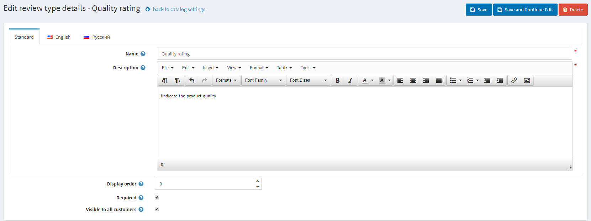
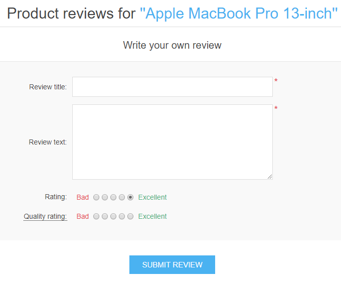
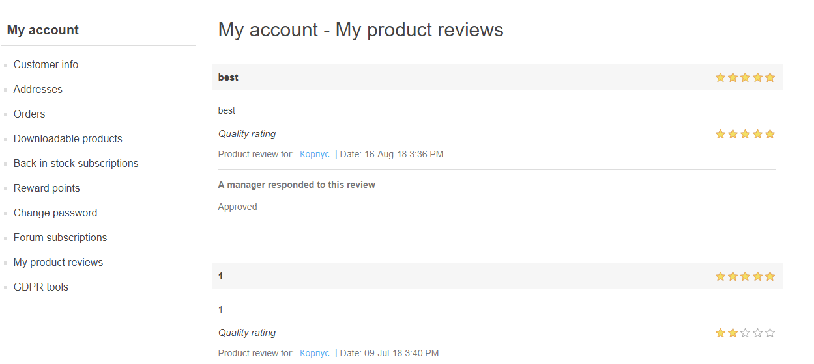
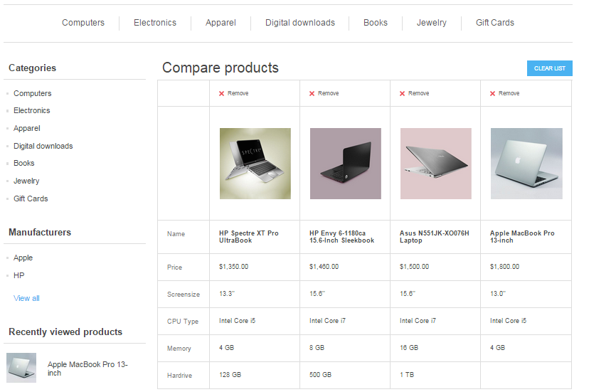
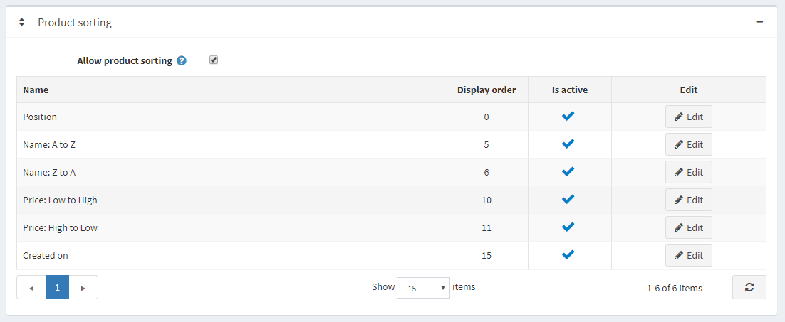

# Catalog settings

Catalog settings include enabling options for product sorting, changing view modes, comparing products and more.

To define catalog settings, go to **Configuration → Settings → Catalog settings**. The catalog settings page is available in *advanced* and *basic* modes (in the advanced mode by default).

## Search
The top panel on the page sets up *Search*:

- Check the **Search enabled** checkbox if you want the search functionality to be enabled in the public store.
- Tick the **Search autocomplete enabled** checkbox, to display the autocomplete search box in the public store, as follows:

When this option is enabled the following additional fields are displayed:

- **Number of 'autocomplete' products to display** sets up the number of results that will be visible in the autocomplete dropdown list of the search box in the public store.
- Tick the **Show a link to all search results in the autocomplete box** checkbox to display the link to all results in the autocomplete search box. Displayed if the number of items found is greater than the displayed quantity in the autocomplete box.
- Tick the **Show product images in autocomplete box** checkbox to enable displaying product images in the autocomplete search box.
- **Search term minimum length** is a minimum number of chars required for the search.
- Tick the **Search page. Allow customers to select page size** checkbox if you want to allow customers to select the page size from the predefined list of options.
- In the **Search page. Page size options** field enter a comma separated list of page size options for customers, or enter the number of products that you want to display on the search products page.

## Product reviews
The second panel sets up *Product reviews*. Define the following:

- **Product reviews must be approved**, to enforce product reviews to be approved by a store administrator prior to being published.
- **Allow anonymous users to write product reviews**, to allow anonymous users to write product reviews. 
- **Product review possible only after product purchasing**, to allow reviewing the product only by customers who have already ordered it.
- **Notify about new product reviews**, to notify the store owner about new public reviews.
- **Notify customer about product review reply**, to notify customer about product review reply.
- **Reviews per store**, allows displaying only reviews of the current store (on the product details page). Untick this checkbox if you want your customers to see the product's reviews written in all of your stores.
- **Show product reviews tab on 'My account' page**, to allow customers see all their reviews on 'My account' page.
- **Product reviews page size** is the amount of reviews per page.
- **Sort by ascending**, to sort product reviews by creation date as ascending.

## Review types
The next block sets up *Review types*. You can configure a list of review types if you think that a basic review is not enough.

Click **Add new button** to create a new review type.

Define the following:

- Enter your review type **Name**.
- Enter the review type **Description**.
- Define the **Display order**.
- When **Required** customers have to choose an appropriate rating value before they can continue.
- **Visible to all customers** sets visibility of the review type for all customers.

Click the **Save** button to add a new review type.

Now in the public store customers will be able to fill additional ratings on the product review page.

Also on this page you can see the left feedback of all customers (if this setting is active). In the customer personal account page there is also an opportunity to see all the reviews left on the products.

## Performance
The next panel sets up *Performance*. Having the following settings enabled can significantly improve the store performance:

- **Ignore ACL rules (sitewide)** turns off the [ACL rules](xref:en/running-your-store/customer-management/access-control-list) configured for entities.
- **Ignore limit per store (sitewide)** allows to ignore limit per stores rules configured for entities. It is recommended to enable this setting if you have only one store or do not have any store-specific limitations. Read more about multi-store in the [Multi-store](xref:en/getting-started/advanced-configuration/multi-store) section. 
- **Ignore discounts (sitewide)**.
- **Ignore featured products (sitewide)**.
- **Cache product prices**. You should not enable it if you use some complex discounts, discount requirement rules, or coupon codes.

## Share
Sharing options from the *Share* panel allow to set up an opportunity for shoppers to share the products across their social media networks. The options will appear as small icons on product pages. To set up the sharing options:

- Tick the **Show a share button** to display a share button on the product details page. When this field is selected the **Share button code** field is displayed.
- The **Share button code** field displays the pages button code.

> [!TIP]
> 
> By default, AddThis service is used ([http://www.addthis.com/](http://www.addthis.com/)).

This is how share links look like:

- Tick the **'Email a friend' enabled** checkbox to allow customers to use the "Email a friend" option.
- **Allow anonymous users to email a friend** if needed.

## Compare products
Compare products option enables customers to compare different offers based on their characteristics and price so they can make the best shopping decisions. Set up the *Compare products* block, as follows:

- Tick the **'Compare products' enabled** checkbox, to make customers be able to compare product options in your public store. The button *Add to compare list* will appear on product pages.
- Tick the **Include short description in compare products** checkbox, to display short product descriptions on the compare products page.
- Tick the **Include full description in compare products** checkbox, to display full product descriptions on the compare products page.

## Additional sections
The *Additional sections* panel allows you to set the following options:

- Check the **Remove required products** checkbox to automatically remove required product from cart when the main product is removed.
- **Show best sellers on home page** allows you to show best sellers on home page.
	- If the previous checkbox is ticked you will be able to enter the **Number of best sellers on home page**.
- Check the **'Products also purchased' enabled** checkbox, to enable customers to view a list of products also purchased by others who purchased the above.
	- When the previous option is enabled, the **Number of also purchased products to display** field appears, in which the store owner can set the number of products to be displayed.
- Check the **'Recently viewed products' enabled** checkbox, to enable customers to see products recently viewed in your store.
	- In the **Number of 'Recently viewed products'** field, enter the number of recently viewed products to be displayed when the previous checkbox is ticked.
- Check the **'New products' page enabled** checkbox if you want the 'New products' page to be enabled in the store.
	- In the **Number of products on 'New products' page** field, enter the number of recently added products to display when the *'New products' page enabled* is checked.
- Tick the **Display the date for a pre-order availability** checkbox if needed.

## Product fields
On the *Product fields* panel you can set the following options:
- To **Show SKU on product details page**.
- To **Show SKU on catalog pages**.
- To **Show GTIN** in the public store.
- To **Show manufacturer part number** in the public store.

## Product page
On the *Product page* panel you can set the following options:
- To **Show "free shipping" icon** for products with this option enabled.
- To **Allow viewing of unpublished product details page**. In this case, SEO will not be affected, and search crawlers will index the page, even though a product is temporary unpublished and invisible for the customers. Note that a store owner always has access to unpublished products.
- Tick the **Discontinued message for unpublished products** checkbox, to display "a product has been discontinued" message when customers try to access details pages of unpublished products.

## Catalog pages
The *Catalog pages* panel enables you to set:
- **Allow view mode changing** on the categories and manufacturers pages.
- The **Default view mode** to either *Grid* or *List*.
- **Include products from subcategories** when viewing a category details page.
- To **Show number of distinct products beside each category** in the category navigation area located in the left column in the public store.
- **Category breadcrumb enabled**. Select to enable the category path (breadcrumb). This is the bar at the top of the screen that indicates which categories and subcategories the product was viewed in on the product pages. Each sub-element of the bar is a separate hyperlink.
- **Number of manufacturers to display** in the manufacturer navigation block.

## Tags
On the *Tags* panel you can define:
- **Number of product tags (cloud)** - the number of tags that appear in the tag cloud.
- To **Allow customers to select 'Products by tag' page size** on the product tag page from a predefined list of options defined by the store owner. When disabled, customers will not be able to select a page size and the store owner enters it.
- If the previous option is checked, the **'Products by tag' page size options** field becomes visible. You can enter values which can be selected by shop users. Numbers should be separated with commas. First value will be the default.

## Tax
Certain tax/shipping info options specific to Germany are available on the *Tax* panel:
- **Display tax/shipping info (footer)**.
- **Display tax/shipping info (product details page)**.
- **Display tax/shipping info (product boxes)**.
- **Display tax/shipping info (shopping cart)**.
- **Display tax/shipping info (wishlist)**.
- **Display tax/shipping info (order details page)**.

## Export/Import
On the *Export/import* panel you can define:
* Tick the **Export/import products with attributes** checkbox if you need product attributes to be exported/imported whenever you export/import the product.
* Tick the **Export/import products with specification attributes** checkbox if products should be exported/imported with specification attributes.
* Tick the **Export/import products with category breadcrumb** checkbox if products should be exported/imported with a full category name including names of all its parents.
* Tick the **Export/import categories using name of category** checkbox if categories should be exported/imported using name of category.
* Tick the **Export/import products. Allow download images** checkbox if images can be downloaded from remote server when exporting products.
* Tick the **Export/import products. Allow splitting file** checkbox if you want to import products from individual files of the optimal size, which were automatically created from the main file. This function will help you import a large amount of data with a smaller delay.
* Tick the **Export/import related entities using name** checkbox if related entities should be exported/imported using name.
* Tick the **Export/import products with "limited to stores"** checkbox if products should be exported/imported with "limited to stores" property.

## Product sorting
On the *Product sorting* panel you can define:
* Tick the **Allow product sorting** checkbox, to enable a product sorting option on the categories and manufacturers pages. You can activate/deactivate sorting by *Position*, *Name*, *Price* and *Date of creation*.

You can edit the **Display order** and **Is active** property of each option by clicking the **Edit** button.