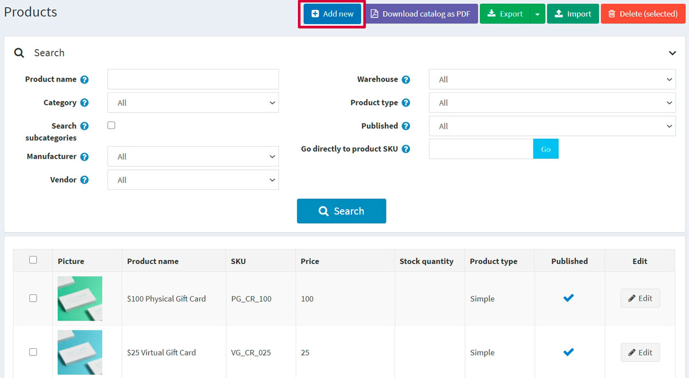
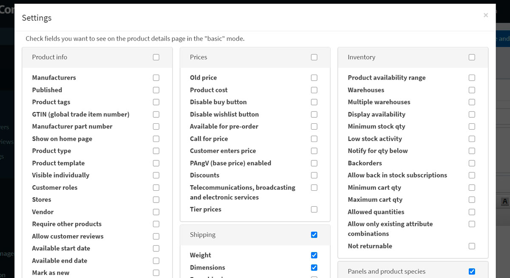
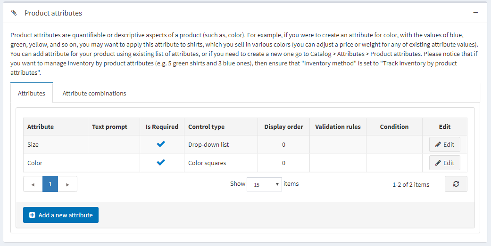
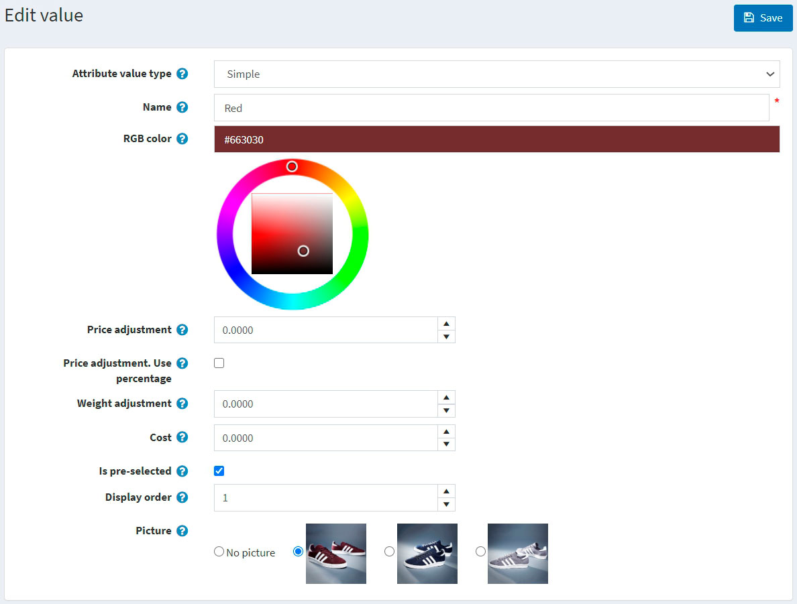
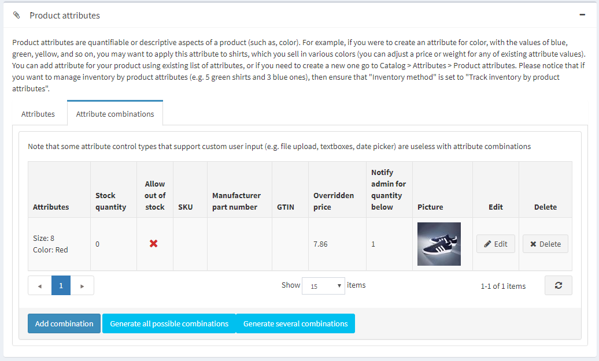
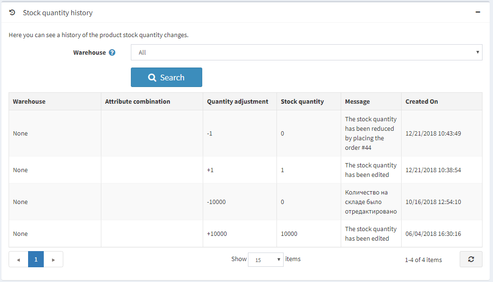

# Add products

Setting up products in the best way possible is highly important for a store. Make sure to not miss any detail, such as displaying different size and color options, giving a thorough product description, adding appealing pictures, etc.

To add a new product, go to **Catalog → Products**. Click **Add new** button in the right top corner.

> [!NOTE]
> 
> You can import products from an external file by clicking the **Import** button. Once you have a list of products, you can export it to an external file for backup purposes, by clicking the **Export** button. After clicking the **Export** button you will see the dropdown menu enabling you to **Export to XML (all found)** or **Export to XML (selected)** and **Export to Excel (all found)** or **Export to Excel (selected)**. Additionally, it is possible to **Download catalog as PDF** to print the selected products to a PDF file. To remove products from the list, select the items to be deleted and click the **Delete (selected)** button.

*Add a new product* page is available in two modes: **advanced** and **basic** (in advanced mode by default). You can switch to the basic mode which displays the only required fields.

You can also set up the *basic* mode to choose which exactly fields you want to be required. To do this click the **Settings** button beside the swith. The *Setting* popup will be displayed, as follows:

Tick the needed fields and click **Save**. Note that the page will be refreshed in this case.

## Product info

Start by filling up general information on the *Product info* panel:

- Enter the **Product name**.
- Enter the product **Short description** that will be displayed in the catalog.
- Enter the product **Full description** that will be shown on the product details page. Here you can add text, bullet points, links, or additional images. Make sure to write a detailed description as it affects your buyers' decision making.
- Enter the product **SKU**. This is the product stock keeping unit, used internally for tracking the product. This is your internal unique ID used to track this product.
- **Categories**. You can assign a product to as many categories as you want. You can manage [product categories](xref:en/running-your-store/catalog/categories) in **Catalog → Categories**.

- **Manufacturers**. You can assign a product to as many manufacturers as you want. You can manage [manufacturers](xref:en/running-your-store/catalog/manufacturers) in **Catalog → Manufacturers**.

- Tick **Published**, to make the product visible in your store.
- Enter the **Product tags**, the keywords for product identification. Enter tags separating them by comma. The more products are associated with a particular tag, the larger it will look in the *Popular tags* cloud, displayed in the sidebar of the catalog page. Read more how to manage product tags in the [Product tags](xref:en/running-your-store/catalog/products/product-tags) section.
  
  

- Enter the **GTIN (global trade item number)**. These identifiers include UPC (in North America), EAN (in Europe), JAN (in Japan), and ISBN (for Books).
- Enter the **Manufacturer part number**. It's a part number provided by a manufacturer for the product.
- Tick the **Show on homepage** checkbox to display this product on your store's home page. Recommended for your most popular products. If this checkbox is ticked, the store owner can also specify the **Display order** of the product. 1 represents the top of the list.
- Set up the **Product type** as *Simple* or *Grouped*. Read more about product types in the [Grouped products (variants)](xref:en/running-your-store/catalog/products/grouped-products-variants) chapter.
- The **Product template** field is visible if you have any custom product templates installed on the **Sysytem → Templates** page.
- Tick **Visible individually** if you want the product to be in catalog or search results, otherwise the product will be hidden in the catalog and accessible only from a grouped product details page.
- Choose **Customer roles** which will be able to see the product in the catalog. Leave this field empty if this option is not required and the product can be seen by everyone. 
    > [!NOTE]
    >
    > In order to use this functionality you have to disable the following setting: **Configuration → Catalog settings → Ignore ACL rules (sitewide)**. Read more about access control list [here](xref:en/running-your-store/customer-management/access-control-list).
- Choose the stores in the **Limited to stores** field if the product is sold in specific stores. Leave the field empty in case this functionality is not required.
  > [!NOTE]
  >
	> In order to use this functionality, you have to disable the following setting: **Catalog settings → Ignore "limit per store" rules (sitewide)**. Read more about multi-store functionality [here](xref:en/getting-started/advanced-configuration/multi-store).

- **Vendor**. You can manage [vendors](xref:en/running-your-store/vendor-management) in **Customers → Vendors**.
- Define whether the product **Require other products**. In this case select the **Required product IDs** entering them separated by comma, ensure that there are no circular references, e.g. A requires B, B requires A. Chose to **Automatically add these products to the cart** if required.
- Tick **Allow customer reviews**, to enable customers to review this product.
- Define **Available start date** and/or **Available end date** of the product availability.
- Tick **Mark as new**, to mark the product as recently added. This way you can manage a list of products displayed on the "New products" page. You can also specify a period during which this product will be marked as new using the **Mark as new. Start date** and **Mark as new. End date** fields.
- In the **Admin comment** field enter a comment for information purposes. This comment is for internal use only, not visible for customers.

## Price

On the *Price* panel define:

- **Price**, in a predefined currency.
    > [!NOTE]
    >
    > You can change the store currency in **Configuration → Currencies**. Read more about currencies [here](xref:en/getting-started/configure-payments/advanced-configuration/currencies).

- **Old price**. If it is larger than zero it becomes visible in the public store and is displayed beside the new price for comparison purposes.
- **Product cost**, the sum of all costs associated with the production of the product or service. This is not displayed to customers.
- To **Disable buy button**. This can be useful for products "upon request".
- To **Disable wishlist button**.
- **Available for pre-order** if the product is not in the store yet, but you want the customers to be able to order it. The *Pre-order* button will be displayed to replace the standard *Add to cart* button in the public store. When this option is selected, the **Pre-order availability start date** field is displayed. Enter the availability start date of the product in UTC. The *Pre-order* button will be changed to *Add to cart* when this date is reached.
- **Call for price**, to show *Call for pricing* or *Call for quote* instead of the price on the product details page in the public store. This can help you to establish a contact with your customers and provide with additional information about the product they are interested in.
- **Customer enters price**, to indicate that a customer must enter the price. When selected, the following fields are displayed:
  - In the **Minimum amount** field, enter the minimum amount for the price.
  - In the **Maximum amount** field, enter the maximum amount for the price.
- **PAngV (base price) enabled**, if the product has a base price. This is required according to the German law (PAngV). For example, if you sell 500ml of beer for 1,50 euro, you have to show the base price: 3.00 euro per 1L. When selected, the following fields are displayed:
  - **Amount in product** - amount of the product that is being sold.
  - **Unit of product** - measure of a previously entered value.
  - **Reference amount** - the base amount.
  - **Reference unit** - measure of a previously entered value.
- **Discounts**. Learn how to set up discounts [here](xref:en/running-your-store/promotional-tools/discounts).
    > [!NOTE]
    >
    > If you want to use discounts make sure the **Ignore discounts (sitewide)** setting is disabled on the **Configuration → Settings → Catalog settings → Performance panel**.

- Whether the product is exempted from tax, by ticking **Tax exempt**. Otherwise, from the **Tax category** dropdown list, select the required tax classification for this product. Tax categories can be configured by the store owner in  the **Configuration → Tax → Tax categories**.
- The product as **Telecommunications, broadcasting, and electronic services**, to apply special tax rules used in the European Union.
- Set up [tier prices](xref:en/running-your-store/promotional-tools/tier-prices) if required.

## Shipping

Define product-specific shipping details on the *Shipping* panel:

- Tick **Shipping enabled** if the product can be shipped. The section then expands for more details.
- Set the product parameters which will be used for the shipping calculation: **Weight, Length, Width, Height**. 
    > [!NOTE]
    >
    > You can change predefined measures in **Configuration → Shipping → Measures**.

- **Free shipping** if the product is shipped for free.
- **Ship separately** if the product should be shipped separately from other products. If the order includes several items of the product, all of them will be shipped separately.
- **Additional shipping charge**.
- **Delivery date** which will be displayed in the public store.
    > [!NOTE]
    >
    > You can manage delivery date options in **Configuration → Shipping → Delivery dates**.

> [!NOTE]
> 
> There is **Estimate shipping enabled (product page)** setting which can be enabled on **Configuration → Settings → Shipping settings**. 
> This setting allows to display estimate shipping information based on customer's shipping address in pop-up window on the product details page.

## Inventory

Define the inventory settings for the product as described [here](xref:en/running-your-store/order-management/inventory-management).

## Pictures

On the *Pictures* panel you can add the product pictures.

- In the *Add a new picture* area, click **Upload a file** to select a new picture you want to upload to your product page.
- In the **Alt** field, enter a value for the "alt" attribute of "img" HTML element. If empty, then a default rule will be used (e.g. product name).
- In the **Title** field, enter a value for the "title" attribute of "img" HTML element. If empty, then a default rule will be used (e.g. product name).
- Define the **Display order** of the image on a product page. 1 represents the top of the list.

Click **Add product picture** to save the picture.

> [!TIP]
> 
> [YouTube tutorial: Importing mass product images](https://www.youtube.com/watch?v=9BUqR_OGiq4)

## Product attributes 

On the *Product attributes* panel you can add product attributes. Learn more about product attributes and how to create them [here](xref:en/running-your-store/catalog/products/product-attributes). 

### Add a new attribute

Once you have a list of the attributes created, click **Add a new attribute** on the *Attributes* tab. The *Add a new attribute* window is displayed, as follows:

Set up a new attribute:

- From the **Attribute** dropdown list select an attribute.
- Fill the **Text prompt** field, if you want some text to be shown in front of this attribute in the public store.
- Tick **Is required** to set this attribute as required for customers.
- Define the **Control type** for this attribute (e.g. dropdown list, radio button list, etc.).
    > [!NOTE]
    > 
    > For the "Date picker" control type, it is possible to set a number of years to be displayed by using **catalogsettings.countdisplayedyearsdatepicker** parameter on the *All settings (advanced)* page. For example, if you set zero then only current year will be displayed. If you set 5 then current year and the next 5 years will be displayed. Read how to set this up on the [All settings](xref:en/getting-started/advanced-configuration/all-settings) page. 

- Define the **Display order** of the attribute on a product page. 1 represents the top of the list.

Click **Save and continue edit**.
The **Values** panel now displays the predefined values for this attribute. Click **Edit** in the value row if required.

### Edit an attribute value

Edit the attribute value details, as follows:

- Select the **Attribute value type**. There are two attribute value types, *Simple* and *Associated to product*. Choose the *associated to product* type if you want this attribute value to be another product from your catalog and track its stock as well. Here you can use *bundled products functionality* allowing customers to buy different combinations or sets of products as a single product and shoppers have an opportunity to set the required quantity of the attributes using the **Customer enters quantity** field described below.

If the previous setting set to *Associated to product* the following fields will be displayed:
- **Associated product** allows you to choose the product which will be assotiated to this attribute. Use the **Associate a product** button to choose a product.

> [!NOTE]
>
> Make sure there is no any warning after you chose the associated product. Such as:
> 

- Tick the **Customer enters quantity** field to allow a customer to enter the quantity of the attribute (which represents the associated product).
- If the previous field in unticked you can specify the **Product quantity**. Minimum allowed value is 1.
- Enter the **Name** of the attribute.
- Specify the **RGB color** to be used with the color squares attribute control.
- In the **Price adjustment** field enter the price applied when choosing this attribute value. For example '10' to add 10 dollars. Or 10% if **Price adjustment. Use percentage** is ticked.
- Tick the **Price adjustment. Use percentage** which determines whether to apply a percentage to the product. If not enabled, a fixed value is used.
- Use the **Weight adjustment** field to specify the weight adjustment applied when choosing this attribute value.
- Specify the **Cost** field. The attribute value cost is the cost of all the different components which make up this value. This may be either the purchase price if the components are bought from outside suppliers, or the combined cost of materials and manufacturing processes if the component is made in-house.
- Tick the **Is pre-selected** field if this attribute value should be pre-selected for the customer.
- Enter the **Display order** of the attribute value. 1 represents the first item in attribute value list.
- Choose a **Picture** associated to this attribute value. This picture will replace the main product image when this product attribute value is clicked (selected).

Click **Save**.

### Attribute conditions

If required, define conditions for this attribute on the *Condition* panel. Conditional attributes appear if a previous attribute is selected, such as having an option for personalizing clothing with a name and only providing the text input box if the "Personalize" radio button is checked.

- Tick the **Enable condition** checkbox to enable the condition.
- Select the **Attribute** and it's value. When the value is selected the condition is fulfilled. The attribute you added this condition for will be displayed.

### Attribute combinations

On the *Attribute combinations* tab, define different attribute combinations and the following information for each of them:

Click the **Add combination** button to select a new combination and enter it's details:

For each combination define:

- The attributes which the combination contains.
- The current **Stock quantity** of this combination.
- **Allow out of stock**, if you want your customers to be able to purchase product with certain attributes, when out of stock.
- **SKU**.
- **Manufacturer part number**.
- **GTIN**.
- **Overridden price**, if the price for products with certain attributes is different from the product regular price. For example, you can give a discount this way. Leave empty to ignore field.
  > [!NOTE]
  >
  > All other applied discounts will be ignored when this field is specified.
- In the **Notify admin for quantity below** enter the quantity under which the admin will be notified.
- Choose a **Picture** associated to this attribute combination. This picture will replace the main product image when this product attribute combination is selected.

Click **Save**.

> [!NOTE]
>
> Note that some attribute control types that support custom user input (e.g. file upload, textboxes, date picker) are useless with attribute combinations.

To generate all possible combinations use the **Generate all possible combinations** button. Or use the **Generate several combinations** button to manually choose some attribute values to generate necessary combinations.

## Specification attributes

Specification attributes are product features i.e, screen size, number of USB-ports visible on product details page. Specification attributes can be used for filtering products on the category details page. Read more about specification attributes [here](xref:en/running-your-store/catalog/products/specification-attributes).

> [!NOTE]
>
> Unlike product attributes, specification attributes are used for information purposes only.

On the *Specification attributes* panel, add specification attributes.

>[!NOTE]
>
> You can add an attribute for your product using the existing list of attributes, or if you need to create a new one go to **Catalog → Attributes → Specification attributes**.

 To add a new attribute, click the **Add attribute** button and fill the *Add a new product specification attribute* section:

- Select the **Attribute type** from a drop down list.
- Choose the **Attribute** from the list of the pre-created attributes.
- Choose the **Attribute option**.
- **Allow filtering** by this option on a category page, if required.
- Tick **Show on product page**, to make the attribute visible on a product page.
- Set the attribute **Display order**. 1 represents the top of the list.

Click **Save**.

## Product class

Define whether the product is a

- [Gift card](xref:en/running-your-store/promotional-tools/gift-cards)
- [Downloadable product](xref:en/running-your-store/catalog/products/downloadable-products)
- [Rental](xref:en/running-your-store/catalog/products/rental-products)
- [Recurring product](xref:en/running-your-store/catalog/products/recurring-products)

## SEO

Define the following SEO parameters for the product page:

- **Search engine friendly page name** - a name of the page used by search engines. If you enter nothing then the product page URL is formed using the product name. If you enter custom-seo-page-name, then the following custom the URL will be used: `http://www.yourStore.com/custom-seo-page-name`.
- **Meta title** - a title for the web page.
- **Meta keywords** - a brief and concise list of the most important themes (keywords and key phrases) related to the product. These words will be added to the product page header.
- **Meta description** - a brief description of the product that will be added to the product page header.

Read more about SEO [here](xref:en/running-your-store/search-engine-optimization).

## Related products and cross-sells

Set up related products and cross-sells as described [here](xref:en/running-your-store/promotional-tools/cross-sells-and-related-products).

## Purchased with orders

To view a list of orders in which the product was purchased, go to the *Purchased with orders* panel. Here you can check an order's status and view the order in details.

## Stock quantity history

On this tab you can view all the product quantity changes, orders with the product.

## See also

- [Product categories](xref:en/running-your-store/catalog/categories)
- [Product manufacturers](xref:en/running-your-store/catalog/manufacturers)
- [Order management](xref:en/running-your-store/order-management/index)
- [Webinar. First steps in nopCommerce](https://www.youtube.com/watch?v=B_CfgJH0ylM&list=PLnL_aDfmRHwsJn1rnKaXdIcJg4pKJeeXs)

## Tutorials

- [Video tutorial: Adding a new product](https://www.youtube.com/watch?v=wVgTgdQVWPQ&index=2&list=PLnL_aDfmRHwsbhj621A-RFb1KnzeFxYz4)
