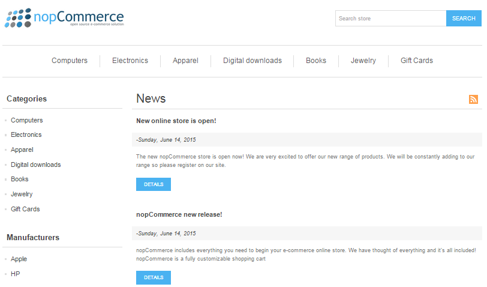
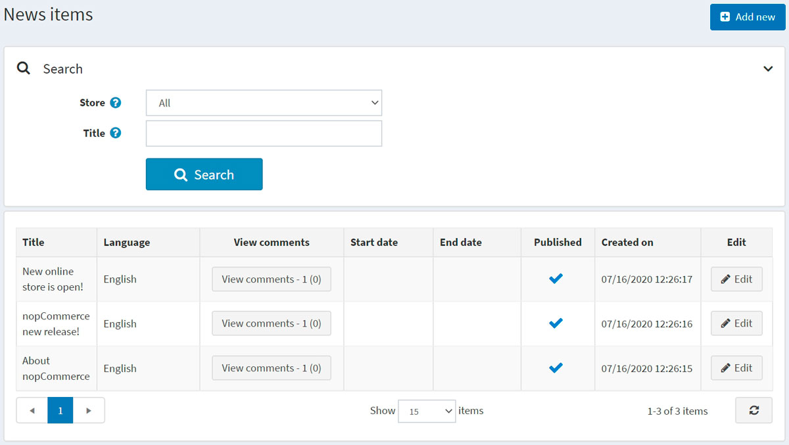
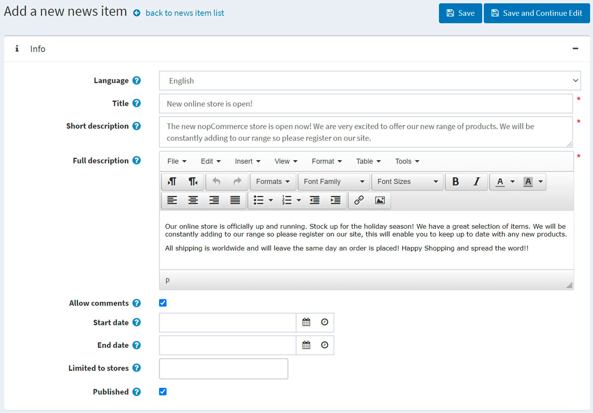
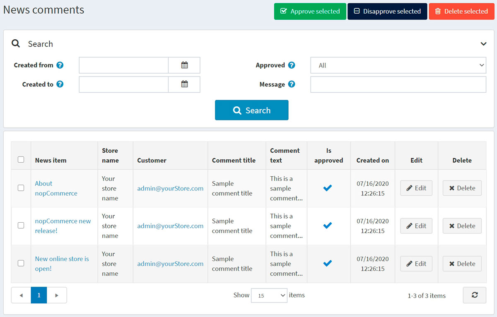
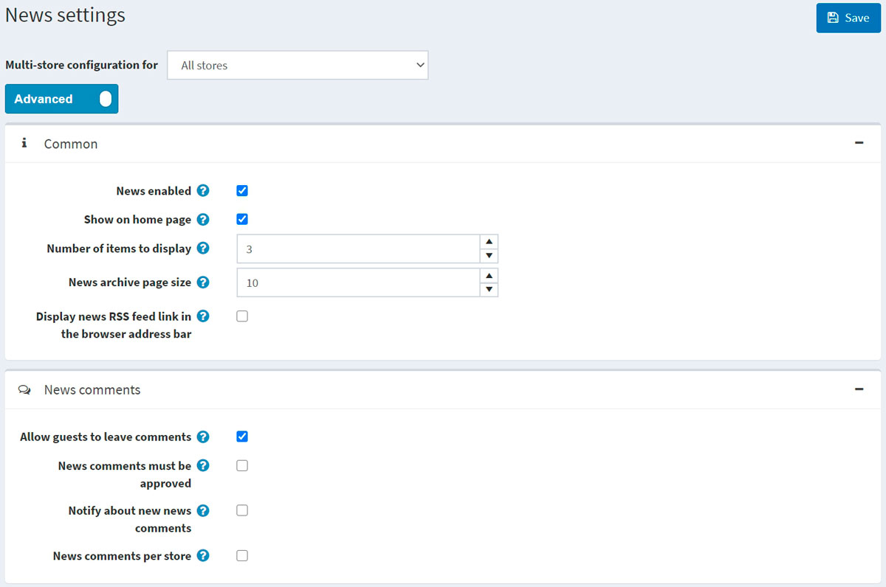

# News

nopCommerce allows you to post news in your store. There can be any important tidings like nopCommerce latest release information, your company updates and so on.

News are displayed in your store on the homepage or on the site footer menu.

To manage news go to **Content management → News itmes**. The list of all news is displayed, as follows: 

## Adding news

To add a new news item click the **Edit** button and fill the information about the news item.

### Info

In the *Info* panel define the following news item details:
- If more than one language is enabled, from the **Language** dropdown list, select the language of this news item. Customers will only see news for their selected language.
- Enter the **Title** of this news item. For example: "The launch of our new nopCommerce store".
- In the **Short description** field, enter an abstract of this news item. This is the text your visitors will see on the news list in the public store.
- In the **Full description** field, enter the text of this news item.
- Select the **Allow comments** checkbox, to enable customers to add comments to the news item.
* Enter **Start date** and **End date** for displaying this news item in Coordinated Universal Time (UTC).

 > [!NOTE]
 > 
 > You can leave these fields empty if you do not want to define news item start and end dates.

- Select the **Published** checkbox, to publish this news item in your store.

While editing an existing news item or after clicking the **Save and continue edit** button for a new one, you can click on the **Preview** button in the top right to see how the news item will appear on the site.

### SEO
In the *SEO* panel define the following news item details: 

- Define the **Search engine friendly page name**. For example, enter "the-best-news" to make your URL `http://yourStore.com/the-best-news`. Leave this field empty to generate it automatically based on the title of the news item.
- Override the page title in the **Meta title** field (the default title is the title of the news item).
- Enter **Meta keywords** - news item meta keywords to be added to the news item header. It is a brief and concise list of the most important themes for the page.
- Enter **Meta description** to be added to the news item header. The meta description tag is a brief and concise summary of the page content.

## Managing news comments

To manage news comments, go to **Content management → News comments**.

Use the **Approve selected** to approve the selected comments and the **Disapprove selected** button to disapprove ones. You can also edit or delete a comment. If delete this comment will be removed from the system.

## News settings

You can manage news settings in **Configuration → Settings → News settings**. This page is available in 2 modes: *advanced* and *basic*.

This page enables multi-store configuration, it means that the same settings can be defined for all stores, or differ from store to store. If you want to manage settings for a certain store, choose its name from multi-store configuration drop-down list and tick all needed checkboxes at the left side to set custom value for them. For further details refer to [Multi-store](xref:en/getting-started/advanced-configuration/multi-store).

### Common

Define the following *Common* settings:
* Select the **News enabled** checkbox, to enable the news functionality in your store.
* Tick the **Show on home page** to display your news items on your store home page.
* Enter the **Number of items to display** on the home page.
* Enter the **News archive page size**. It's a number of news displayed on one page.
* Tick the **Display news RSS feed link in the browser address bar** to enable the news RSS feed link in customers browser address bar.

### News comments

Define the following *News comments* settings:
- Select the **Allow guests to leave comments** checkbox, to enable non-registered users to add comments to the news.
- Select the **News comments must be approved** checkbox if news comments must be approved by administrator.
- Select the **Notify about new news comments** checkbox, to notify the store owner about new news comments.
- Select the **News comments per store** checkbox, to display news comments written in the current store only.

Click **Save**.

## Tutorials

- [Managing news in nopCommerce](https://www.youtube.com/watch?v=ztLlRXvBQK4)