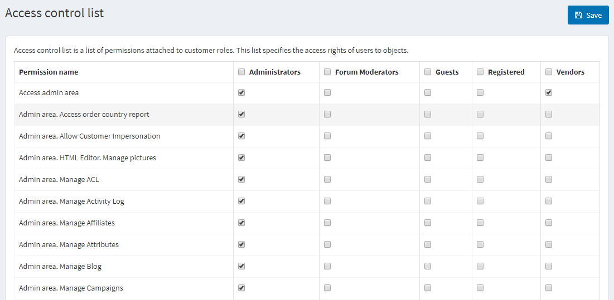

# Access control list

Access Control List (ACL) restricts or grants users an access to certain areas of the site. This list is managed by administrators. Therefore, the user must have administrator rights to be able to access it. The access list has the following characteristics:

* Access control list is role-based, i.e. manages roles such as Global Administrators, Content Managers, etc. This list of roles can be managed in the **Customers Roles** window **(Customers → Customer Roles).**
* Access control list appears in the Administration area. Make sure, the user is an administrator in order to access the ACL.
* Predefined administrator actions exist. These include Manage Orders, Manage Customers and much more.

**To manage an access control list:**

Go to **Configuration → Access Control List.** The Access control list window is displayed:

Select the required roles beside the **Customer action** items. The selected roles will have access to the selected actions accordingly.

Click **Save.**

> [!TIP]
> 
> Example: We need a role called Content Manager. The content Manager must have access to new products and manufacturers management, editing of the reviews on site, blogs, campaigns, and have no access to shopping carts.
> 
> 1. Create the Customer role called Content Manager in Customer Roles section (Customers → Customer Roles).
> 1. In the ACL tick the checkbox next to the following permissions: Access admin area, Admin area. Manage Blog, Admin area. Manage Campaigns, Admin area. Manage Forums, Admin area. Manage News, Admin area. Manage Newsletter Subscribers, Public store. Allow navigation, Public store. Display Prices
> 1. Save the changes
