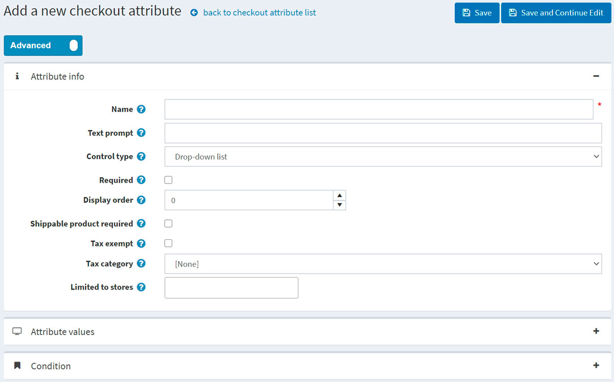
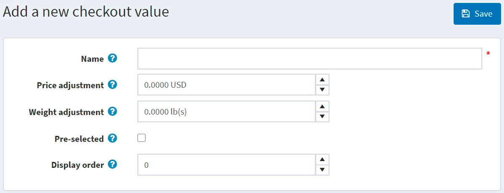

# Checkout attributes

Checkout attributes represent additional order information that is gathered during the final stage of the shopping process.

> [!TIP]
> 
> Using the checkout attributes shop owners can specify, for example, whether a bought product requires gift-wrapping or careful handling as in a case of fragile goods.

Checkout attributes are displayed on the shopping cart page and enable users to select them, if required, before the checkout.

To set up or edit checkout attributes, go to **Catalog → Attributes → Checkout attributes**.

You can select checkout attributes and click the **Delete (selected)** button to delete them.

## Add a new checkout attribute

To create a new checkout attribute, click **Add new**. The *Add a new checkout attribute* window will be displayed, as follows:

This page is available in two modes: **advanced** and **basic**. Switch to the basic mode which displays the only main fields or use the advanced mode displaying all the available fields.

In the *Attribute info* panel, define the following information:

- **Name** - the attribute name.
- **Text prompt** - a question or a comment that will be displayed in the checkout area on the shopping cart page.
- From the **Control type** dropdown list, select the required method for displaying the attribute value: *Dropdown list*, *Radio button list*, *Checkboxes*, *Textbox*, etc.

  > [!NOTE]
  > 
  > Dropdown lists, radio lists, checkboxes and color squares require the store owner to define values (such as Green, Blue, Red and so on). *Textbox* and *Date picker* control types do not require the store owner to define values since customers will be requested to fill these textbox fields. In addition, for some control types, you can specify validation rules. For example: for the *Textbox* attribute, you can define the **Minimum length**, **Maximum length** and **Default value**. For the *File upload* attribute, you can define **Allowed file extension** and **Maximum file size (KB)**.

- Tick the **Required** checkbox if selecting an attribute value is required before completing the purchasing process.
- **Display order** - display order number of the checkout attribute.
- Tick **Shippable product required** checkbox in case this attribute should only be displayed for product that needs to be shipped.
- Ticked **Tax exempt** checkbox indicates that tax will not be applied to this checkout attribute.
- In case the tax is applied, from the **Tax category** dropdown list, select the checkout attribute tax category.
- **Limited to stores** enables you to limit the attribute to one or more stores. > [!NOTE] > > In order to use this functionality, you have to disable the following setting: **Catalog settings → Ignore "limit per store" rules (sitewide)**. Read more about multi-store functionality [here](xref:en/getting-started/advanced-configuration/multi-store).

Click **Save and continue edit** to proceed to the *Attribute values* panel (if applicable).

### Add a new checkout attribute value

In the *Attribute values* panel, click **Add a new checkout value** to create a new attribute value.

In the *Add a new checkout value* window, define the following information:

- **Name** - the attribute value name.

  > [!TIP]
  > 
  > For example, *Yes* or *No*, for questions such as "Do you require fragile care handling"?

- **Price adjustment** will add the entered amount to a purchase total sum in case the attribute value is selected.
- **Weight adjustment** will change an order weight by the entered amount in case the attribute value is selected.
- Tick the **Pre-selected** checkbox, to indicate the attribute value is pre-selected for a customer.
- **Display order** - display order number of the attribute value.

You can **Edit** and **Delete** attribute values by clicking the corresponding buttons beside the attributes in the *Attribute values* panel.

## Add a condition

In the *Condition* panel, a store owner can specify a condition for the checkout attribute to be visible (depending on other attributes). Conditional attribute only appears if a previous attribute is selected.

Click **Save**. The the new attribute will be displayed on the shopping cart page in the public store.

## Tutorials

- [Adding checkout attributes](https://www.youtube.com/watch?v=sJcZP1qjHmY&list=PLnL_aDfmRHwsbhj621A-RFb1KnzeFxYz4&index=3)
- [Overview of conditional checkout attributes](https://www.youtube.com/watch?v=z3UiXgK8Jgo&list=PLnL_aDfmRHwsbhj621A-RFb1KnzeFxYz4&index=18)
