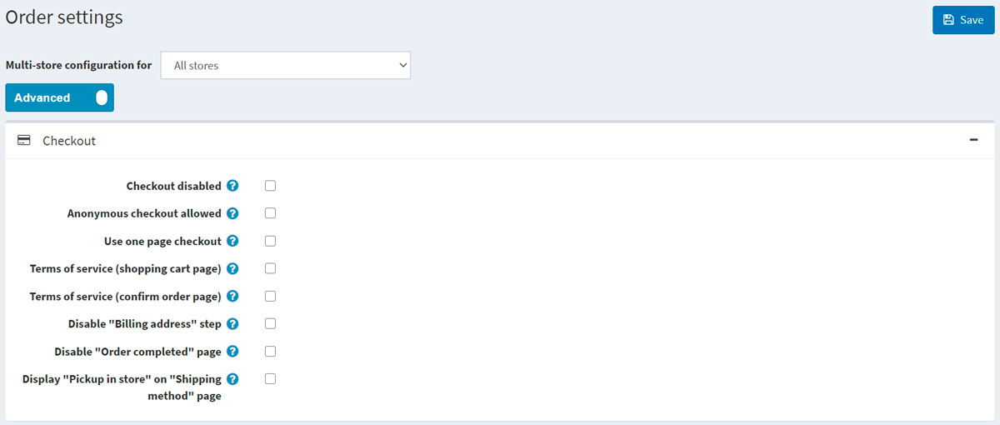
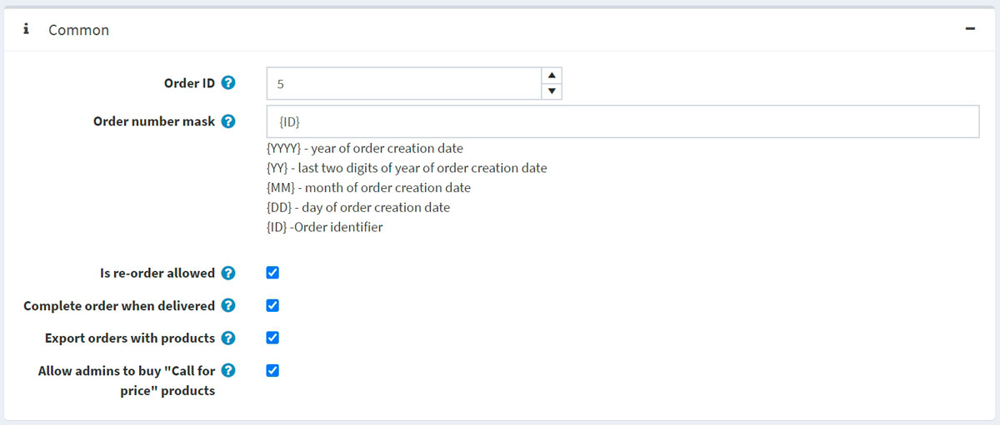

# Order settings

To define order settings, go to **Configuration → Settings → Order settings**. The *Order settings* window will be displayed. 

This page enables multi-store configuration, it means that the same settings can be defined for all stores, or differ from store to store. If you want to manage settings for a certain store, choose its name from multi-store configuration drop-down list and tick all needed checkboxes at the left side to set custom value for them. For further details refer to [Multi-store](xref:en/getting-started/advanced-configuration/multi-store).

In this window you can define the following order settings:

## Checkout
Define the following settings in the *Checkout* panel:

* **Checkout disabled**, to disable the checkout process.
* **Anonymous checkout allowed**, to enable customers to purchase products without registration/logging in.
* To **Use one page checkout**, which is a single web page your customers would use to buy a product or a service from you.
* **Order totals on payment info tab** to display a product list and order totals on the payment info tab (one page checkout).
* To require customers to accept the **Terms of service** before processing the order (**on the shopping cart page**).
* To require customers to accept the **Terms of service** before processing the order (**on the confirm order page**).
* To **Disable "Billing address" step** during checkout. The billing address will be pre-filled and saved using the default registration data (cannot be used with guest checkout selected). On the **Configuration → Settings → Customer settings** ensure the appropriate address fields that cannot be pre-filled are not required (or disabled).
* To **Disable "Order completed" page**, to automatically redirect a customer to the order details page after an order is placed.
* To **Display "Pickup in store" on "Shipping method" page** or on the shipping address page.

## Order totals
Define the following settings in the *Order totals* panel:

* **Min order sub-total amount**. Orders under this amount will not be issued.
* To **Calculate "Min order sub-total amount" including tax**. In this case, an order sub-total will be calculated including tax when validating **Min order sub-total amount field** specified in the previous step.
* **Min order total amount**. Orders under this amount will not be issued.
* To **Auto update order totals** to have the order totals automatically updated on editing an order in admin area (currently in BETA testing).

## Common
Define the following settings in the *Common* panel:

* The **Order ID** counter. This is useful if you want your orders to start at a certain number. This affects only orders created after. The value must be greater than the current maximum order ID.
* In the **Order number mask** you can create custom order number. For example, start with {YYYY} - year of an order creation date.
* **Is re-order allowed** to enable customers to re-order. The re-order mechanism automatically adds to the shopping cart all items that were in a previous order.
* To **Complete order when delivered**, to set order status to "Complete" only when its shipping status is "Delivered". Otherwise, "Shipped" status will be enough.
* To **Export orders with products**.
* **Allow admins to buy "Call for price" products**, to allow administrators (in impersonation mode) to buy products marked as "Call for price".

## PDF invoice
Define the following settings in the *PDF invoice* panel:

* **To Attach PDF invoice ("order placed" email)**.
* **To Attach PDF invoice ("order paid" email)**.
* **To Attach PDF invoice ("order completed" email)**.

> [!TIP]
>
> Learn how to set up PDF in the [PDF settings](xref:en/getting-started/advanced-configuration/pdf-settings) chapter.

## Gift cards
Define the following settings in the *Gift cards* panel:

* **Activate gift cards after completing of an order**, to activate related gift cards when an order is completed.
* **Deactivate gift cards after cancelling of an order**, to deactivate related gift cards when an order is cancelled.
* **Deactivate gift cards after deleting of an order**, to deactivate related gift cards when an order is deleted.
* **Delete gift card usage history after order cancellation**, to to delete gift card usage history after an order is cancelled.

## Return request settings
On the *Return request settings* panel you can set up return requests. For more details see the [Return request](xref:en/running-your-store/order-management/return-requests) chapter.

## See also

* [Orders](xref:en/running-your-store/order-management/orders)
* [PDF settings](xref:en/getting-started/advanced-configuration/pdf-settings)
